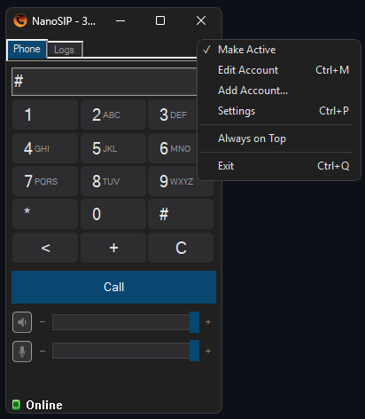
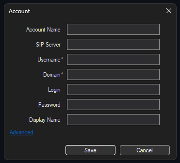
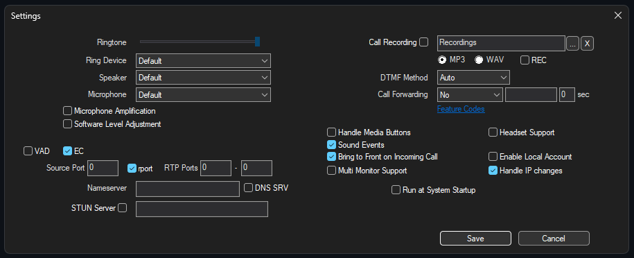

<div align="center">

# 📞 NanoSIP

🇬🇧 [English](#english) · 🇷🇺 [Русский](#русский)

</div>

---

## English

A custom fork of [MicroSIP](https://www.microsip.org/) 3.22.3 (Windows MFC/PJSIP softphone) —
a stripped-down, voice-only build with no update checks and no unnecessary internet access.

> A personal/niche fork for one specific use case (outgoing calls only, no video, no contact
> management), not a general-purpose replacement. For full functionality and support, use the
> original [MicroSIP](https://www.microsip.org/).

Source code lives in the [`NanoSIP/`](NanoSIP) subfolder, not in the repository root.

<p align="center">
  
  
  
</p>

### What's different from the original MicroSIP

- No update checks and no crash-report uploads (local crash dumps still written to disk).
- Fully dark theme.
- Voice only — video codecs disabled.
- No Contacts tab or contact add/edit/import/export.
- External-link menu items removed (Visit Website / Help / Shortcuts).
- Simplified Account dialog — extra fields under a collapsible "Advanced" section; SRTP, TLS,
  Publish Presence and Voicemail removed.
- Fewer dialer buttons — DND, auto-answer and Conference removed; recording off by default.
- Simplified Settings tab — rarely-used options removed; calls, answer/hangup and forwarding
  work as before.

### Building

Requirements:
- Windows 10/11
- Visual Studio Build Tools 2022 with the **"Desktop development with C++"** workload and the
  **MFC/ATL** component (`Microsoft.VisualStudio.Component.VC.ATLMFC`)
- A Windows SDK (any recent 10.0.2xxxx.0)

Build from the repository root (PowerShell):

```powershell
Get-Process microsip,NanoSIP -ErrorAction SilentlyContinue | Stop-Process -Force
& "<path_to_Build_Tools>\MSBuild\Current\Bin\MSBuild.exe" `
  "NanoSIP\microsip.vcxproj" `
  /p:Configuration=Release /p:Platform=Win32 `
  /p:PlatformToolset=v143 /p:WindowsTargetPlatformVersion=10.0.26100.0 `
  /t:Build /m
```

The project hardcodes `PlatformToolset=v140` and `WindowsTargetPlatformVersion=8.1`, neither of
which exists in modern Build Tools — override both via `/p:` to match your installed
toolset/SDK. Close any running instance of the exe first, or the linker fails with `LNK1104`.

Build output: `NanoSIP\Release\NanoSIP.exe`.

### Dependencies

A prebuilt static library is included
(`pjproject/lib/libpjproject-i386-Win32-vc14-Release-Static.lib`), so you don't need to rebuild
pjproject. If you do (e.g. after editing `config_site.h`):

```powershell
& "<path_to_Build_Tools>\MSBuild\Current\Bin\MSBuild.exe" `
  "NanoSIP\pjproject\pjsip-apps\build\libpjproject.vcxproj" `
  /p:Configuration="Release-Static" /p:Platform=Win32 `
  /p:PlatformToolset=v143 /p:WindowsTargetPlatformVersion=10.0.26100.0
```

Build the `Release-Static` config specifically (static CRT, `/MT`) — the plain `Release` uses
the dynamic CRT (`/MD`) and won't link.

### License

[GPL-2.0-or-later](LICENSE), same as the original MicroSIP. Third-party library licenses are
listed in [`THIRD_PARTY_LICENSES.md`](THIRD_PARTY_LICENSES.md).

---

## Русский

Кастомный форк [MicroSIP](https://www.microsip.org/) 3.22.3 (Windows MFC/PJSIP софтфон) —
максимально лёгкая версия только для голосовых звонков, без проверки обновлений и без лишнего
выхода в интернет.

> Личный/нишевый форк под конкретный сценарий (только исходящие звонки, без видео, без записи
> контактов), а не универсальная замена MicroSIP. Если нужны полная функциональность и
> поддержка — используйте оригинальный [MicroSIP](https://www.microsip.org/).

Исходники лежат в подпапке [`NanoSIP/`](NanoSIP), а не в корне репозитория.

<p align="center">
  
  
  
</p>

### Что изменено относительно оригинального MicroSIP

- Без проверки обновлений и отправки crash-report (локальная запись дампов на диск оставлена).
- Полностью тёмная тема.
- Только голос — видео-кодеки отключены.
- Без вкладки и функций Contacts.
- Убраны пункты меню со ссылками наружу (Visit Website / Help / Shortcuts).
- Упрощённый диалог Account — лишние поля под секцией «Дополнительно»; убраны SRTP, TLS,
  Publish Presence, Voicemail.
- Меньше кнопок на звонилке — убраны DND, авто-ответ и Conference; запись по умолчанию выключена.
- Упрощённая вкладка настроек — убраны редкие опции; звонки, ответ/отбой и переадресация
  работают как раньше.

### Сборка

Нужны:
- Windows 10/11
- Visual Studio Build Tools 2022 с workload **"Desktop development with C++"** и компонентом
  **MFC/ATL** (`Microsoft.VisualStudio.Component.VC.ATLMFC`)
- Windows SDK (любой относительно новый 10.0.2xxxx.0)

Сборка из корня репозитория (PowerShell):

```powershell
Get-Process microsip,NanoSIP -ErrorAction SilentlyContinue | Stop-Process -Force
& "<путь_к_Build_Tools>\MSBuild\Current\Bin\MSBuild.exe" `
  "NanoSIP\microsip.vcxproj" `
  /p:Configuration=Release /p:Platform=Win32 `
  /p:PlatformToolset=v143 /p:WindowsTargetPlatformVersion=10.0.26100.0 `
  /t:Build /m
```

Проект хардкодит `PlatformToolset=v140` и `WindowsTargetPlatformVersion=8.1` — обоих нет в
современных Build Tools, поэтому переопределяйте их через `/p:` под установленную версию.
Перед сборкой закройте запущенный exe, иначе линковщик выдаст `LNK1104`.

Результат сборки: `NanoSIP\Release\NanoSIP.exe`.

### Зависимости

Готовая статическая либа уже входит в репозиторий
(`pjproject/lib/libpjproject-i386-Win32-vc14-Release-Static.lib`), пересобирать pjproject не
нужно. Если всё же нужно (например, после правок в `config_site.h`):

```powershell
& "<путь_к_Build_Tools>\MSBuild\Current\Bin\MSBuild.exe" `
  "NanoSIP\pjproject\pjsip-apps\build\libpjproject.vcxproj" `
  /p:Configuration="Release-Static" /p:Platform=Win32 `
  /p:PlatformToolset=v143 /p:WindowsTargetPlatformVersion=10.0.26100.0
```

Собирайте именно `Release-Static` (статический CRT `/MT`) — обычная `Release` собирается с
динамическим CRT (`/MD`) и не слинкуется.

### Лицензия

[GPL-2.0-or-later](LICENSE), как и оригинальный MicroSIP. Лицензии сторонних библиотек — в
[`THIRD_PARTY_LICENSES.md`](THIRD_PARTY_LICENSES.md).
